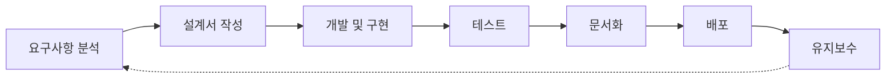

# 안녕하세요, 풀스택 개발자 황인찬입니다 👨‍💻

## 🚀 About Me

- 🔭 저의 소개 페이지 링크입니다: [포트폴리오](https://klklgooa.github.io/klklgooa)
- 🌱 웹 개발 풀스택 및 클라우드를 학습중이에요
- 💼 스프링 기반 백엔드 개발을 해왔어요
- 📚 MySQL, API, Java 등 다양한 프로그래밍 언어와 기술을 숙련했습니다
- 💡 RestAPI와 MariaDB, MongoDB를 활용하여 다양한 프로젝트를 성공적으로 수행했습니다
- 🔍 항상 새로운 기술에 대한 호기심을 가지고 공부하며 더 나은 솔루션을 찾아내는 능력을 가지고 있습니다
- 🎯 주어진 업무에 몰입하여 최선을 다하고자 합니다
- 👥 꼼꼼함을 기반으로 세심한 배려를 하며 팀원들과 협력하여 업무 효율을 높이는 데 주력합니다

 

## 🛠️ 기술 스택

### 언어

  
  
  
  
  

### 프런트엔드

  
  
  
  
  
  

### 백엔드

  
  
  
  

### 데이터베이스

  
  
  

### 개발 도구

  
  
  
  

### AI/ML

  
  
  

### 문서 작성

  
  
  

 

## 📊 프로젝트 갤러리

  <table>
    <tr>
      <td width="50%">
        
        

          <strong>RESTful API 서비스 개발</strong> 
          Spring Boot와 MariaDB를 활용한 확장 가능한 API 설계 및 구현
        

      </td>
      <td width="50%">
        
        

          <strong>실시간 채팅 애플리케이션</strong> 
          WebSocket과 STOMP를 활용한 실시간 통신 구현
        

      </td>
    </tr>
    <tr>
      <td width="50%">
        
        

          <strong>텍스트 분석 AI 서비스</strong> 
          koBERT와 koELECTRA 모델을 활용한 한국어 자연어 처리
        

      </td>
      <td width="50%">
        
        

          <strong>크로스 플랫폼 모바일 앱</strong> 
          Flutter를 이용한 iOS/Android 통합 애플리케이션 개발
        

      </td>
    </tr>
  </table>

 

## 🔄 업무 프로세스

 

## 🌐 Connect with me

  
  
  

 

## 📝 최근 블로그 포스트
- [Spring Security를 활용한 인증 시스템 구축하기](https://link-to-your-blog)
- [MongoDB와 Spring Boot 연동 가이드](https://link-to-your-blog)
- [Flutter로 크로스 플랫폼 앱 개발하기](https://link-to-your-blog)
- [koELECTRA를 활용한 감성분석 구현](https://link-to-your-blog)

 

> "항상 새로운 기술에 대한 호기심을 가지고, 더 나은 솔루션을 찾아내는 것이 제 개발 철학입니다."

  

